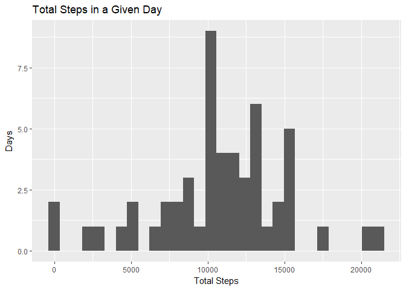
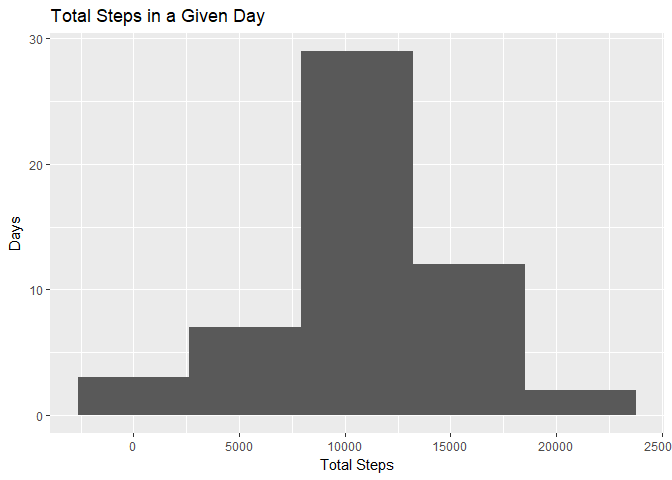
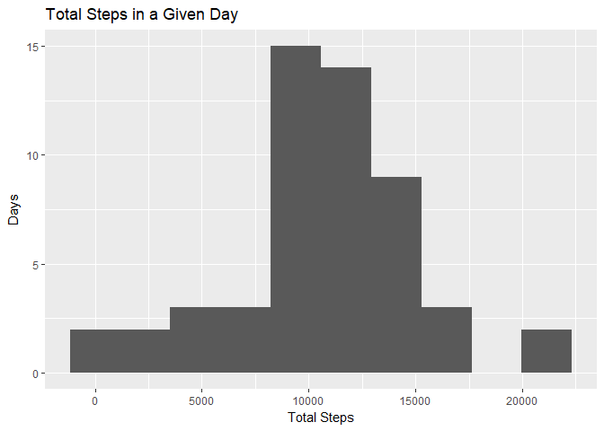
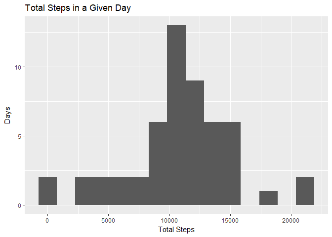
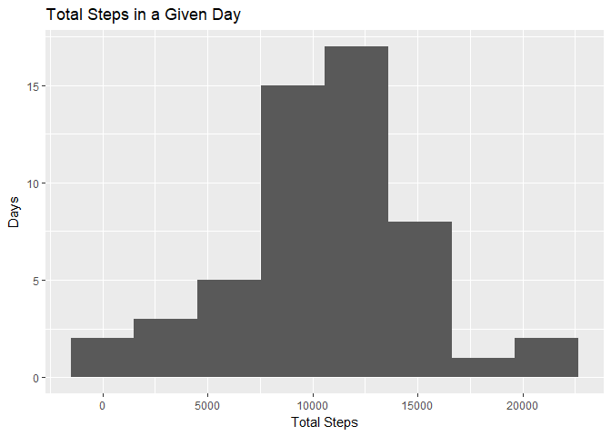
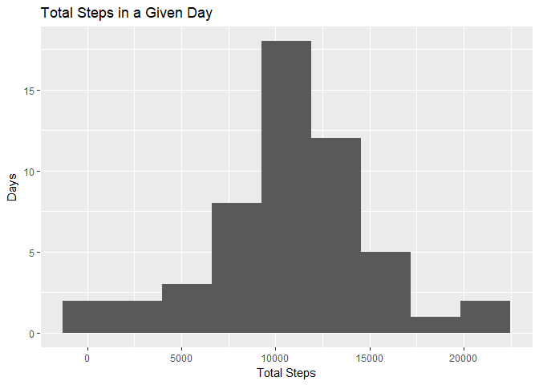
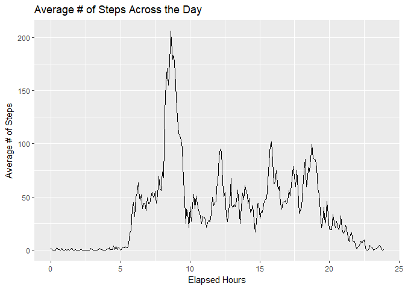
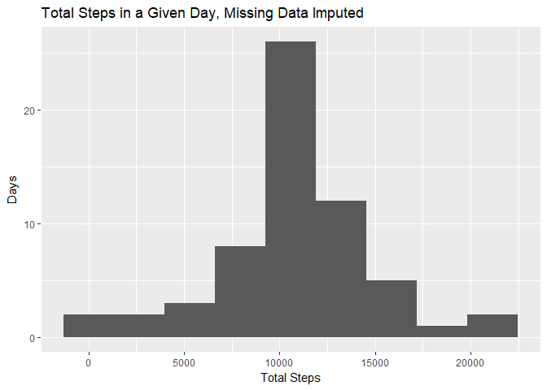
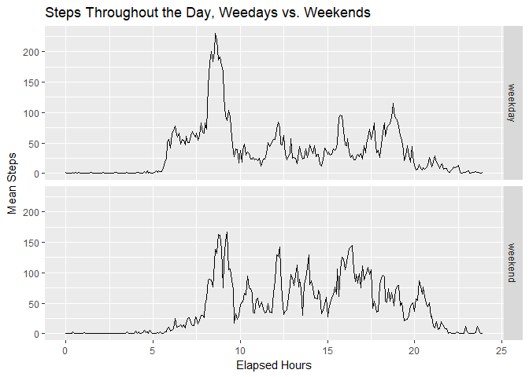

## Overview

This document represents the results of my work for the first of the two course projects in the Reproducible Research course in the Data Science specialization on Coursera. It addresses several questions posed in the assignment concerning the provided pedometer data. In each step, I try to briefly explain how I went about answering the questions, and what my code is doing.

## 1. Loading and preprocessing the data

The first step is to get the raw data into a data frame, which requires downloading the file from the course website, unzipping it, and reading the unzipped csv file "activity.csv" into R. I saved it as activity_data.


```r
download.file(url = "http://d396qusza40orc.cloudfront.net/repdata%2Fdata%2Factivity.zip", destfile = "raw_data.zip")
unzip("raw_data.zip")
activity_data <- read.csv("activity.csv")
```

Next I examined the data.


```r
str(activity_data)
```

```
## 'data.frame':	17568 obs. of  3 variables:
##  $ steps   : int  NA NA NA NA NA NA NA NA NA NA ...
##  $ date    : Factor w/ 61 levels "2012-10-01","2012-10-02",..: 1 1 1 1 1 1 1 1 1 1 ...
##  $ interval: int  0 5 10 15 20 25 30 35 40 45 ...
```

Alright. Just three variables, but all of them need a little work. The variable steps, at least, seems to have misssing data. The date variable is a factor, rather than one of the date/time classes. And the variable interval seems to be representing time of day, in five minute intervals, but it's not a time variable. I decided to examine each variable more closely, and take a few preprocessing steps.

First, I checked for missing data.


```r
sum(is.na(activity_data$steps))
```

```
## [1] 2304
```

```r
sum(is.na(activity_data$date))
```

```
## [1] 0
```

```r
sum(is.na(activity_data$interval))
```

```
## [1] 0
```

Only the steps variable has missing data, but it looks like there's a lot. While it might make sense to deal with this missing data now, it is addressed in one of the later questions, so I leave it until then. On to the date variable!


```r
activity_data$date <- as.Date(activity_data$date)
```

There, now the date variable is a date object. What about the interval variable?


```r
summary(activity_data$interval)
```

```
##    Min. 1st Qu.  Median    Mean 3rd Qu.    Max. 
##     0.0   588.8  1177.5  1177.5  1766.2  2355.0
```

The interval variable is a little trickier. The first two digits are the hour (0-23) and the second two digits are the minutes (0-55). This means that if this variable is treated as a time variable, there will be these weird discontinuities for all values ending in 56-99. Fortunately, it's fairly easy to construct hours and minutes variables, as well as true "time" variables which represent the elapsed minutes and/hour hours in a day. (I made both, but only ended up using the elapsed hours variable).


```r
activity_data$hours <- as.integer(activity_data$interval/100)
activity_data$minutes <- activity_data$interval %% 100
activity_data$elapsed_minutes <- 60*activity_data$hours + activity_data$minutes
activity_data$elapsed_hours <- activity_data$elapsed_minutes/60
```

I considered making one overall time variable, but looking ahead the assignment does not require one. At this point, all of the required preprocessing (excluding missing data imputation -- later!) is complete. Here is what the data look like now:


```r
head(activity_data)
```

```
##   steps       date interval hours minutes elapsed_minutes elapsed_hours
## 1    NA 2012-10-01        0     0       0               0    0.00000000
## 2    NA 2012-10-01        5     0       5               5    0.08333333
## 3    NA 2012-10-01       10     0      10              10    0.16666667
## 4    NA 2012-10-01       15     0      15              15    0.25000000
## 5    NA 2012-10-01       20     0      20              20    0.33333333
## 6    NA 2012-10-01       25     0      25              25    0.41666667
```


## 2.  What is mean total number of steps taken per day?

The next part of the assignment involves exploring the total number of steps per day. Thus, I first used the tapply function to generate a sum for each day.


```r
daily_totals <- tapply(activity_data$steps, activity_data$date, sum)
head(daily_totals)
```

```
## 2012-10-01 2012-10-02 2012-10-03 2012-10-04 2012-10-05 2012-10-06 
##         NA        126      11352      12116      13294      15420
```

Next, I explored these totals with a histogram. For practice, I used ggplot2.


```r
library(ggplot2)
```

```
## Warning: package 'ggplot2' was built under R version 3.4.4
```

```r
g <- ggplot(as.data.frame(daily_totals), aes(daily_totals))
g + geom_histogram() + ggtitle("Total Steps in a Given Day") + xlab("Total Steps") + ylab("Days")
```

```
## `stat_bin()` using `bins = 30`. Pick better value with `binwidth`.
```

```
## Warning: Removed 8 rows containing non-finite values (stat_bin).
```

<!-- -->

Eww, that's sort of a gross looking histogram. Thus, I tried a few different binning options...


```r
g + geom_histogram(bins = 5) + ggtitle("Total Steps in a Given Day") + xlab("Total Steps") + ylab("Days")
```

```
## Warning: Removed 8 rows containing non-finite values (stat_bin).
```

<!-- -->

```r
g + geom_histogram(bins = 10) + ggtitle("Total Steps in a Given Day") + xlab("Total Steps") + ylab("Days")
```

```
## Warning: Removed 8 rows containing non-finite values (stat_bin).
```

<!-- -->

```r
g + geom_histogram(bins = 15) + ggtitle("Total Steps in a Given Day") + xlab("Total Steps") + ylab("Days")
```

```
## Warning: Removed 8 rows containing non-finite values (stat_bin).
```

<!-- -->

```r
g + geom_histogram(bins = 8) + ggtitle("Total Steps in a Given Day") + xlab("Total Steps") + ylab("Days")
```

```
## Warning: Removed 8 rows containing non-finite values (stat_bin).
```

<!-- -->

```r
g + geom_histogram(bins = 9) + ggtitle("Total Steps in a Given Day") + xlab("Total Steps") + ylab("Days")
```

```
## Warning: Removed 8 rows containing non-finite values (stat_bin).
```

<!-- -->

With a little experimentation, I found that 9 bins is the largest number of bins for which each bin captures some of the data. Thus, I went with 9 bins for the final histogram. Unsure of whether R Markdown actually saves these files separately, I also created a .png file of the chart.


```r
g + geom_histogram(bins = 9) + ggtitle("Total Steps in a Given Day") + xlab("Total Steps") + ylab("Days")
```

```
## Warning: Removed 8 rows containing non-finite values (stat_bin).
```

<!-- -->

```r
dev.copy(png, file = "plot1.png")
```

```
## png 
##   3
```

```r
dev.off()
```

```
## png 
##   2
```

And, finally, here are both the mean and median of total daily steps:


```r
mean(daily_totals, na.rm = TRUE)
```

```
## [1] 10766.19
```

```r
median(daily_totals, na.rm = TRUE)
```

```
## [1] 10765
```

Cool! Ok, on to the next step. 

## 3. What is the average daily activity pattern?

The next question asks us to look at the average number of steps for each interval, averaged across days. For this part, I first made a vector of these interval means.


```r
interval_means <- tapply(activity_data$steps, activity_data$interval, mean, na.rm = TRUE)
```


Next, I plotted these means over time (across intervals). For practice, I chose to look at this pattern with qplot rather than ggplot. To make sure I displayed an actual time-series, I used the elapsed hours variable I created earlier. This is because the interval variable is not actually a time, but a code which has hours as hundreds and minutes as ones. I've chosen to use elapsed hours rather than elapsed minutes, because it seems a little easier to interpret a number of hours (0-24) on the x-axis, rather than a number of minutes (0 - 1440). I also copied this file to a png.


```r
qplot(unique(activity_data$elapsed_hours), 
     interval_means, 
     geom = "line",
     xlab = "Elapsed Hours",
     ylab = "Average # of Steps",
     main = "Average # of Steps Across the Day")
```

<!-- -->

```r
dev.copy(png, file = "plot2.png")
```

```
## png 
##   3
```

```r
dev.off()
```

```
## png 
##   2
```

Looks cool! Less activity during the hours you'd expect a person to be asleep, and pretty widely variable activity during the waking hours.

Additionally, the problem asks us to find the interval with the highest number of steps, averaged across days:


```r
which(interval_means == max(interval_means))
```

```
## 835 
## 104
```

So, interval 835 (or, 8:35-8:40), has the highest average steps. Cool! How many?


```r
max(interval_means)
```

```
## [1] 206.1698
```

Fun! Next section!


## 4. Imputing missing values

Ok, time to deal with NAs. After spending way too much time trying to decide on the very best imputation method, I decided it just wasn't worth it for the sake of this problem. I don't really know how to do mean imputation yet, or at least not well. So, I just imputed each NA with the mean for that interval, as this is explicitly suggested by the prompt.

First, I once again explored what proportion of the data are missing.


```r
sum(is.na(activity_data$steps))
```

```
## [1] 2304
```

```r
sum(is.na(activity_data$date))
```

```
## [1] 0
```

```r
sum(is.na(activity_data$interval))
```

```
## [1] 0
```

```r
mean(is.na(activity_data$steps))
```

```
## [1] 0.1311475
```

Ah yes, there are 2,304 NAs in the steps data, representing about 13.11% of the data. (None of the date or interval values were missing.)

Next, I replaced the NAs with the appropriate value from interval_means. As requested in the exercise, I created a new data set instead of just overwriting the old one.


```r
activity_data_imputed <- activity_data
```

Then I populated the new chart with the interval mean data for every row.


```r
activity_data_imputed$interval_means <- rep(interval_means, 61)
```

Next, I replaced the NAs with the appropriate interval mean.


```r
activity_data_imputed$steps[is.na(activity_data_imputed$steps)] <- activity_data_imputed$interval_means[is.na(activity_data_imputed$steps)]
```

Did it work?


```r
sum(is.na(activity_data_imputed$steps))
```

```
## [1] 0
```

```r
sum(activity_data$steps, na.rm = TRUE)
```

```
## [1] 570608
```

```r
sum(activity_data_imputed$steps)
```

```
## [1] 656737.5
```

Good! No more NAs. And the sum for the imputed data is higher than the sum for the non-imputed data, so the imputation did something! Wonderful. Now it's time to recreate the histogram from earlier and recalculate the mean and median to see if imputing the missing values made a difference.

First, new daily totals, with the imputed data.


```r
daily_totals_imputed <- tapply(activity_data_imputed$steps, activity_data_imputed$date, sum)
```

Next (using ggplot again, so I could copy the code from earlier :P), I plotted the histogram of the imputed data across days.


```r
g <- ggplot(as.data.frame(daily_totals_imputed), aes(daily_totals_imputed))
g + geom_histogram(bins = 9) + ggtitle("Total Steps in a Given Day, Missing Data Imputed") + xlab("Total Steps") + ylab("Days")
```

<!-- -->

```r
dev.copy(png, file = "plot3.png")
```

```
## png 
##   3
```

```r
dev.off()
```

```
## png 
##   2
```

Ok, so that looks like pretty much the exact same histogram... What about the median and mean?


```r
mean(daily_totals_imputed)
```

```
## [1] 10766.19
```

```r
median(daily_totals_imputed)
```

```
## [1] 10766.19
```

The same! The mean is EXACTLY the same, while the median is slightly different, to reflect that non-integer values were introduced by the imputation. Ok, cool! Fixing the missing data didn't make everything go crazy! On to the final part of the assignment!


## 5. Are there differences in activity patterns between weekdays and weekends?

Finally, I investigated activity on weekdays and weekends, to see how activity differs between the two.

First, I just figured out which day of the week each day is.


```r
activity_data_imputed$day <- weekdays(activity_data_imputed$date)
```

And then I made a variable which factorizes weekends vs. weekdays.


```r
activity_data_imputed$weekdays <- "weekday"
activity_data_imputed$weekdays[activity_data_imputed$day == "Saturday" | activity_data_imputed$day == "Sunday"] <- "weekend"
table(activity_data_imputed$weekdays)
```

```
## 
## weekday weekend 
##   12960    4608
```

Looks good! Next, I created averages for steps per interval, separately for weekends and weekdays. To make things easier with ggplot, I then combined them into one table. I also make corresponding variables of appropriate length to identify elapsed hours (elapsed_hours2) and weekday vs. weekend (wd_we). I'm sure there is a cleaner way to do this, but this works well enough.


```r
weekdays <- activity_data_imputed[activity_data_imputed$weekdays == "weekday",]
weekends <- activity_data_imputed[activity_data_imputed$weekdays == "weekend",]
weekday_means <- tapply(weekdays$steps, weekdays$interval, mean)
weekend_means <- tapply(weekends$steps, weekends$interval, mean)
combined_means <- c(weekday_means, weekend_means)
wd_we <- rep(c("weekday","weekend"), each = 288)
elapsed_hours <- unique(activity_data$elapsed_hours)
elapsed_hours2 <- rep(elapsed_hours, 2)
```

And then a call to qplot to create the two graphs, one on top of the other.


```r
qplot(elapsed_hours2,
      combined_means,
      facets = as.factor(wd_we) ~ .,
      geom = "line",
      xlab = "Elapsed Hours",
      ylab = "Mean Steps",
      main = "Steps Throughout the Day, Weedays vs. Weekends")
```

<!-- -->

```r
dev.copy(png, file = "plot4.png")
```

```
## png 
##   3
```

```r
dev.off()
```

```
## png 
##   2
```

Nifty! It's hard to say for sure, but it looks like weekdays have a large spike of activity toward the beginning of the day, whereas activity on the weekends is more evenly distributed across time. 

## Conclusion

That concludes the analysis for this course project! Thanks for reading.
